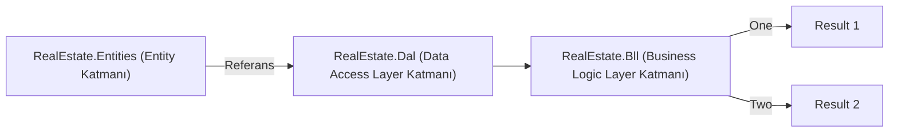

### Katmanlı Mimari Açıklaması ve Repository Pattern

Merhaba, ABC Şirketi için hazırlanan gayrimenkul arama uygulamasında, aşağıdaki gibi çok katmanlı bir mimari ve Repository Pattern kullanarak projeyi oluşturduk. Bu yaklaşım, kodun daha sürdürülebilir, okunabilir ve test edilebilir olmasını sağlar.

#### Entity Katmanı

Bu katman, uygulamadaki veri modellerini ve bu modellere ait yapılandırmaları içerir. Tüm varlıklar burada tanımlanır ve yapılandırmaları yapılır.

#### Data Access Layer (Veri Erişim Katmanı)

Veri Erişim Katmanı, veritabanı ile etkileşim kuran katmandır. Bu katman, veri erişimi için gerekli tüm işlemleri gerçekleştirir. `Configurations` klasörü, varlıkların yapılandırmalarını içerir. Örneğin, `AppUserConfiguration` ve `ProductConfiguration` gibi sınıflar, Entity Framework Core kullanılarak veritabanı tablolarını yapılandırmak için kullanılır. Bu katman, Repository Pattern kullanılarak veri erişim kodlarını soyutlar ve merkezileştirir. Bu sayede veri erişim işlemleri daha modüler ve yönetilebilir hale gelir.

#### Business Logic Layer (İş Akış Katmanı)

İş Akış Katmanı, uygulamanın temel işlevselliğini barındıran ve iş süreçlerini yönettiğimiz katmandır. Bu katman, veri işleme, iş kurallarını uygulama, güvenlik, hata yönetimi ve veri işleme akışını yönetme gibi görevleri üstlenir. 

#### Repository Pattern

Repository Pattern, veritabanı işlemlerini soyutlamak ve kod tabanını düzenlemek için kullanılan bir tasarım desenidir. Bu desen, veri erişim kodlarını genel olarak merkezleştirir ve veritabanı işlemlerini doğrudan diğer katmanlara karşı gizler. Böylece kodun daha sürdürülebilir, okunabilir ve test edilebilir olması sağlanır. Repository Pattern, veri erişim katmanını iş akış katmanından ayırarak kodun modülerliğini ve esnekliğini artırır.

Bu mimari ile iş akışlarını veri erişim katmanından ayırarak projeyi genişletilebilir ve esnek bir yapıya kavuşturduk. Veri erişim işlemlerini Repository Pattern ile soyutladık ve sadece veri erişimi ile ilgilenmesini sağladık. Bu sayede, ileride yeni bir veri erişim teknolojisi kullanmamız gerektiğinde, sadece veri erişim katmanında değişiklik yaparak iş akışını bozmadan yeni teknolojiyi entegre edebiliriz.

Bu yapıyı kullanarak, projenin doğru mimaride ve genişletilebilir olması ile yeni isteklere göre esnek bir şekilde geliştirilebilir olmasını sağladık. Bu sayede projeyi değerlendiren kişiler, mimari yapının esnekliği ve sürdürülebilirliği konusunda daha iyi bir anlayışa sahip olacaktır.

### Özet
1. **Entity Katmanı**: Uygulamadaki veri modellerini ve yapılandırmaları içerir.
2. **Data Access Layer**: Veri erişim işlemlerini gerçekleştirir ve Repository Pattern ile veri erişim kodlarını soyutlar.
3. **Business Logic Layer**: Uygulamanın iş süreçlerini yönetir ve veri işleme, iş kurallarını uygulama gibi görevleri üstlenir.

Bu mimari, kodun modülerliğini, sürdürülebilirliğini ve test edilebilirliğini artırarak projeyi daha yönetilebilir hale getirir.

### Yeni Migration Oluşturma:

`dotnet ef database update ApplicationDbInitial --output-dir Migrations --project RealEstate.Dal.csproj --context CustomContext --startup-project ../RealEstate.WebAPI/RealEstate.WebAPI.csproj -v`

### Özet Veritabanını Güncelleme:
**Oluşturduğunuz migration'ı veritabanına uygulamak için:**

`dotnet ef database update --project RealEstate.Dal.csproj --context CustomContext --startup-project ../RealEstate.WebAPI/RealEstate.WebAPI.csproj -v`
